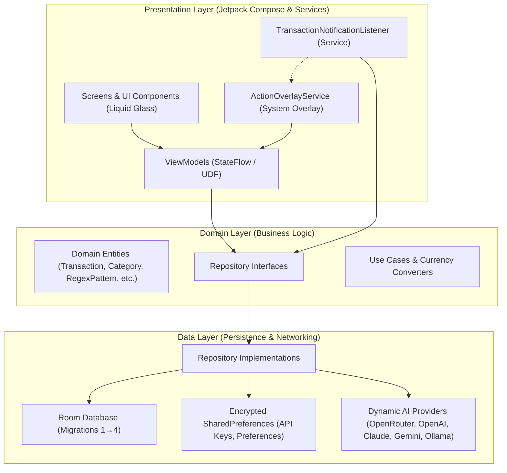
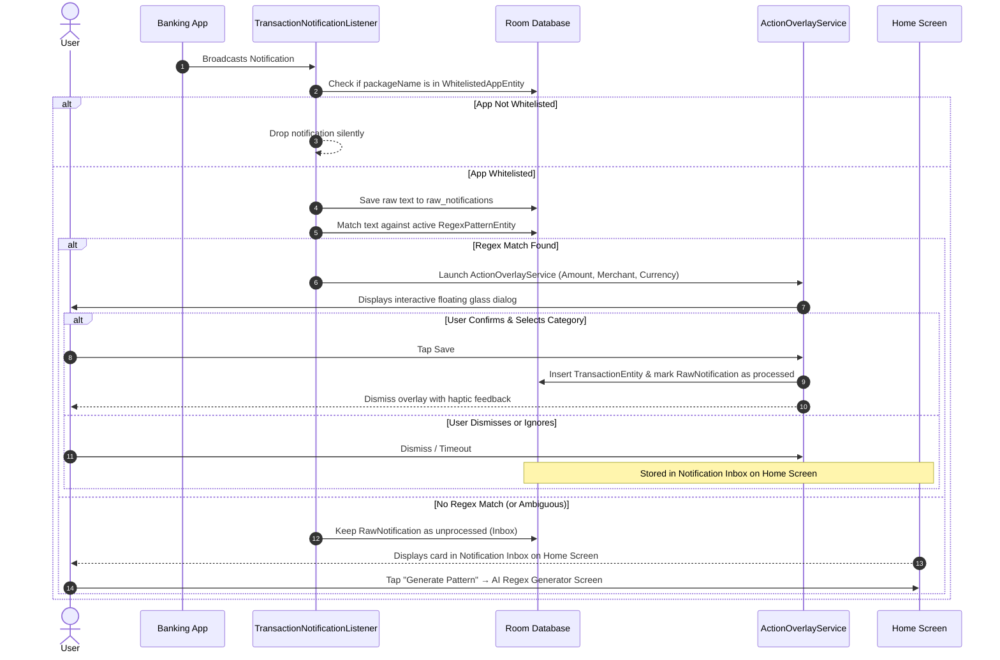

# SpendSense Architecture Documentation

## Overview

SpendSense is built using **Clean Architecture** and the **MVVM (Model-View-ViewModel)** design pattern. It follows an **offline-first** design principle, using a local Room SQLite database as the single source of truth for all financial transactions, categorization rules, and settings.

---

## High-Level Architecture Diagram

---

## Architectural Layers

### 1. Presentation Layer
- **Jetpack Compose (Material 3):** 100% declarative UI with custom Cyber-Premium design tokens.
- **120 FPS Sibling Background Architecture:**
  - Standard glassmorphism that nests scrollable lists directly inside shader capture regions suffers from recursive re-rendering, causing dropped frames and crashes.
  - SpendSense decouples the render hierarchy into two siblings:
    - **Sibling 1:** `Box(Modifier.fillMaxSize().liquefiable(screenLiquidState)) { AppBackground() }` — renders the active background theme (gradients or custom image) and provides pixels to the AGSL shader pipeline.
    - **Sibling 2:** `Box(Modifier.fillMaxSize())` — renders interactive content (`LazyColumn`, `SpendSenseTopBar`, cards, dialogs) outside the liquefiable node. Individual cards sample the background via `Modifier.glassEffect()` without triggering recursive layout invalidations.
- **State Management:** Unidirectional Data Flow (UDF) powered by Kotlin `StateFlow` and Compose `collectAsStateWithLifecycle()`.
- **System Services:**
  - `TransactionNotificationListener`: Subscribes to Android's `NotificationListenerService` to filter, capture, and extract transactions in real-time.
  - `ActionOverlayService`: Displays an interactive, floating `WindowManager` view over third-party banking apps for immediate 1-tap categorization.

### 2. Domain Layer
- **Pure Kotlin:** Completely decoupled from the Android framework, UI, and database libraries.
- **Domain Models:**
  - `Transaction`: Represents an expense or income entry.
  - `Category`: Represents a spending category with customizable colors and icons.
  - `RegexPattern`: Represents a regex parsing rule mapped to a specific banking package.
  - `WhitelistedApp`: Represents an installed app enabled for notification monitoring.
  - `RawNotification`: Represents captured raw alerts before or after parsing.
  - `AiProvider`: Represents configured LLM endpoints for pattern generation.
- **Repository Interfaces:** Explicit contracts defining data persistence and retrieval boundaries.

### 3. Data Layer
- **Room Database (`SpendSenseDatabase`):** Persistent storage using SQLite with versioned migrations (currently version 4).
- **Secure Preferences (`SecurePreferences`):** AndroidX `EncryptedSharedPreferences` for sensitive credentials (API keys, default currency, selected background themes).
- **Dynamic AI Client:** A dynamic Retrofit / OkHttp abstraction that dispatches LLM prompt requests to any OpenAI-compatible, Anthropic Claude, or Google Gemini API endpoint.

---

## Transaction Capture Sequence (The "Inbox" Pattern)

---

## Room Database Schema (Version 4)

### `transactions` Table
| Column | Type | Constraints | Description |
|---|---|---|---|
| `id` | INTEGER | PRIMARY KEY AUTOINCREMENT | Unique transaction ID |
| `amount` | REAL | NOT NULL | Transaction monetary amount |
| `currencyCode` | TEXT | NOT NULL DEFAULT 'USD' | 3-letter ISO currency code |
| `merchant` | TEXT | NOT NULL | Extracted merchant / store name |
| `categoryId` | INTEGER | NULLABLE | Foreign key to `categories.id` |
| `timestamp` | INTEGER | NOT NULL | Epoch millisecond timestamp |
| `sourcePackageName` | TEXT | NOT NULL | Originating app package name |
| `notes` | TEXT | NULLABLE | Optional user notes |
| `paymentSource` | TEXT | NULLABLE | Account or card identifier |
| `paymentSourceType` | TEXT | NULLABLE | Credit, Debit, Cash, etc. |
| `isSynced` | INTEGER | NOT NULL DEFAULT 0 | Cloud synchronization status flag |

### `categories` Table
| Column | Type | Constraints | Description |
|---|---|---|---|
| `id` | INTEGER | PRIMARY KEY AUTOINCREMENT | Unique category ID |
| `name` | TEXT | NOT NULL | Category display name |
| `iconName` | TEXT | NOT NULL | Material icon identifier |
| `colorHex` | TEXT | NOT NULL | Hex color code (e.g. `#00D4FF`) |
| `isDefault` | INTEGER | NOT NULL DEFAULT 0 | Built-in system category indicator |

### `regex_patterns` Table
| Column | Type | Constraints | Description |
|---|---|---|---|
| `id` | INTEGER | PRIMARY KEY AUTOINCREMENT | Unique rule ID |
| `packageName` | TEXT | NOT NULL | Target bank app package |
| `pattern` | TEXT | NOT NULL | Regular expression with named groups |
| `titlePattern` | TEXT | NULLABLE | Optional filter for notification title |
| `currencyCode` | TEXT | NOT NULL DEFAULT 'USD' | Currency associated with rule |
| `isActive` | INTEGER | NOT NULL DEFAULT 1 | Rule enabled toggle |
| `lastUsed` | INTEGER | NOT NULL DEFAULT 0 | Last matched timestamp |
| `successCount` | INTEGER | NOT NULL DEFAULT 0 | Number of successful extractions |

### `whitelisted_apps` Table
| Column | Type | Constraints | Description |
|---|---|---|---|
| `packageName` | TEXT | PRIMARY KEY | Unique application package name |
| `appName` | TEXT | NOT NULL | User-visible display name |
| `isEnabled` | INTEGER | NOT NULL DEFAULT 1 | Whether notifications are intercepted |
| `addedAt` | INTEGER | NOT NULL | Installation / detection timestamp |

### `raw_notifications` Table
| Column | Type | Constraints | Description |
|---|---|---|---|
| `id` | INTEGER | PRIMARY KEY AUTOINCREMENT | Unique record ID |
| `packageName` | TEXT | NOT NULL | Source application package |
| `title` | TEXT | NULLABLE | Raw notification title |
| `text` | TEXT | NOT NULL | Raw notification body |
| `timestamp` | INTEGER | NOT NULL | Receipt timestamp |
| `isProcessed` | INTEGER | NOT NULL DEFAULT 0 | Processing status flag |
| `stalePatternId`| INTEGER | NULLABLE | ID of regex pattern that failed |

### `ai_providers` Table
| Column | Type | Constraints | Description |
|---|---|---|---|
| `id` | INTEGER | PRIMARY KEY AUTOINCREMENT | Unique provider ID |
| `name` | TEXT | NOT NULL | Provider name (OpenRouter, Gemini, etc.) |
| `baseUrl` | TEXT | NOT NULL | Base HTTP endpoint |
| `apiKey` | TEXT | NOT NULL | Encrypted API key |
| `defaultModel` | TEXT | NOT NULL | Selected model identifier |
| `jobType` | TEXT | NOT NULL | Target capability (e.g. `REGEX_GEN`) |
