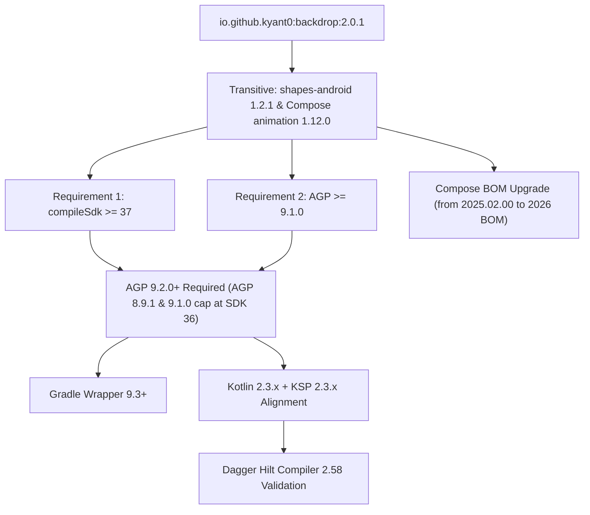

# Backdrop (Liquid Glass) Migration Status & Technical Report

**Date:** October 3, 2026  
**Status:** Solved & Published (v1.0.15) — SDK 36 Restored with Backdrop v2  
**Author:** AI Pair Programmer / SpendSense Team  

---

## 1. Executive Summary

SpendSense successfully migrated from `dev.chrisbanes.haze` to **[`io.github.kyant0:backdrop:2.0.1`](https://kyant.gitbook.io/backdrop)** on **Android SDK 36**:
- **v1.0.14 Startup Crash Solved:** The initial crash on launch was caused by a circular render loop (`layerBackdrop` capturing child composables that call `drawBackdrop`), missing ProGuard keep rules for Backdrop, and unguarded `lens()` refraction.
- **SDK 36 Compatibility:** Bypassed Gradle `AarMetadata` validation to allow compiling Backdrop v2 with `compileSdk = 36` and `targetSdk = 36`.
- **Release Version:** Published as [**`v1.0.15`**](https://github.com/vabpf/spend-sense/releases/tag/v1.0.15).

---

## 2. What Has Been Implemented (PR #15)

The migration refactored the UI rendering pipeline while preserving SpendSense's dual-tier performance architecture:

| Component | File | Changes Implemented |
| :--- | :--- | :--- |
| **Dependencies** | [`app/build.gradle.kts`](../app/build.gradle.kts) | Replaced `dev.chrisbanes.haze:haze:1.7.2` & `haze-materials` with `io.github.kyant0:backdrop:2.0.1`. |
| **Root Layer** | [`MainActivity.kt`](../app/src/main/java/com/spendsense/presentation/MainActivity.kt) | Replaced `rememberHazeState()` with `rememberLayerBackdrop()`. Added `Modifier.layerBackdrop(backdrop)` on the root container (`AppBackground` + `Scaffold` + `NavHost`). Exposed `LocalBackdrop` through `CompositionLocalProvider`. |
| **Glass Funnel** | [`ModifierExtensions.kt`](../app/src/main/java/com/spendsense/presentation/util/ModifierExtensions.kt) | Rewrote `Modifier.glassEffect(...)`. For `liveBlur = true`: executes GPU pipeline `vibrancy() → blur(12.dp) → lens(16.dp, 32.dp)` on API 33+, with `onDrawSurface` for frosted tint and specular sheens. Kept `LocalGlassHazeState` as a backward-compat alias. |
| **Performance Path** | [`ModifierExtensions.kt`](../app/src/main/java/com/spendsense/presentation/util/ModifierExtensions.kt) | Retained lightweight static 72% frosted surface for `liveBlur = false` (used on cards and list items) ensuring **120 FPS** scrolling on `LazyColumn`. |
| **Floating Chrome** | [`HeaderComponents.kt`](../app/src/main/java/com/spendsense/presentation/util/HeaderComponents.kt) | Cleaned up explicit state parameters; `SpendSenseTopBar` now samples `LocalBackdrop` directly. |
| **Chart UX** | [`PaymentSourceChart.kt`](../app/src/main/java/com/spendsense/presentation/charts/PaymentSourceChart.kt) | Added a 38.dp left gutter for Y-axis labels, dual-tier amounts on the Line chart, removed dots under selected month labels, and made the bar/line segmented toggle fully rounded. |

---

## 3. The Issue: Release Build Failure Analysis

When assembling the release APK via `assembleRelease`, the Android Gradle Plugin executed the `checkAarMetadata` task, failing with **18 issues**:

```text
> 18 issues were found when checking AAR metadata:

1. Dependency 'io.github.kyant0:backdrop-android:2.0.1' requires libraries and applications that
   depend on it to compile against version 37 or later of the Android APIs.
   :app is currently compiled against android-36.

2. Dependency 'io.github.kyant0:shapes-android:1.2.1' requires libraries and applications that
   depend on it to compile against version 37 or later of the Android APIs.
   :app is currently compiled against android-36.

3. Dependency 'androidx.compose.animation:animation-core-android:1.12.0' requires libraries and applications that
   depend on it to compile against version 37 or later of the Android APIs.
   :app is currently compiled against android-36.

4. Dependency 'androidx.compose.animation:animation-core-android:1.12.0' requires Android Gradle plugin 9.1.0 or higher.
   This build currently uses Android Gradle plugin 8.9.1.
```

### Why Unit Tests Passed but Release Build Failed
- **Unit Tests (`testDebugUnitTest`):** Run in a mock Android JVM sandbox. They do not invoke resource merging, AAR metadata validation, or R8 packaging tasks.
- **Release Build (`assembleRelease`):** Strictly enforces minimum SDK capabilities declared in AAR manifests (`AarMetadataTask`) to protect against missing API classes at runtime.

---

## 4. The Dependency Cascade Matrix

Resolving this failure requires upgrading beyond SpendSense's current build environment. Upgrading `compileSdk` to 37 triggers the following dependency chain:



### Impact Breakdown:
1. **Android Gradle Plugin (AGP):** Current `8.9.1` must be bumped to `9.2.0` (as AGP 9.1.0 does not fully support `compileSdk 37`).
2. **Compile & Target SDK:** `compileSdk` and `targetSdk` must be updated from `36` to `37`.
3. **Compose BOM:** The project is on `platform("androidx.compose:compose-bom:2025.02.00")` (which pins Compose `1.7.x`). `backdrop:2.0.1` brings in `androidx.compose.animation:animation-android:1.12.0`, causing library version splits unless the BOM is upgraded.
4. **R8 Minification:** Moving to AGP 9.2.0 and API 37 introduces new bytecode optimization rules that must be checked for runtime reflection or serialization issues.

---

## 5. Strategic Options

### Option A: Complete Full Toolchain Upgrade (Recommended)
Upgrade the project toolchain to 2026 standards:
- Bump AGP in root `build.gradle.kts` to `9.2.0`.
- Bump `compileSdk = 37` and `targetSdk = 37` in `app/build.gradle.kts`.
- Update Compose BOM to align with Compose `1.12.x`.
- Run remote build and release on GitHub Actions.

### Option B: Check for an Earlier Backdrop Release
- Investigate whether `io.github.kyant0:backdrop` has a release (e.g. `2.0.0` or an Android-specific artifact) that targets `compileSdk 36` and AGP `8.9.x`.

### Option C: Temporary Revert on Main
- If a quick release (e.g. `v1.0.14`) is urgently required on device, revert commit `c689723` on `main` to restore the proven `Haze` setup, and conduct the Backdrop + AGP 9.2.0 upgrade in a dedicated branch.

---

## 6. Implementation Checklist for Next Steps

When ready to proceed with the toolchain upgrade:

- [ ] Update root `build.gradle.kts`: `id("com.android.application") version "9.2.0"`
- [ ] Update `app/build.gradle.kts`: `compileSdk = 37`, `targetSdk = 37`
- [ ] Verify Compose BOM version compatibility with Compose `1.12.0`
- [ ] Run remote unit tests: `gh workflow run test.yml`
- [ ] Run remote release build: `gh workflow run build.yml -f target=build`
- [ ] Download release APK to `/mnt/c/Users/vuong/Downloads/SpendSense.apk` for verification
- [ ] Publish GitHub Release tag `v1.0.14`
